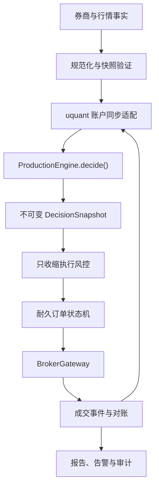

# firmquant 实盘自动交易系统设计规格

## 1. 目的与边界

firmquant 是面向单一 A 股现金账户的日频实盘执行系统。它持续在线，但只在收盘后调用
uquant 形成下一交易日的经济决策；盘中只负责执行、订单生命周期、成交吸收、风控、故障
恢复和对账。它不是新的策略研究项目，也不建立第二套选股、组合分配或风险状态机。

首个交付闭环限定为：

- A 股 AI 产业链证券；
- 单账户、现金多头、无杠杆、禁止做空；
- 日频盘后决策、下一交易日执行；
- 单机 Windows 券商终端环境；
- 默认 PAPER，真实订单默认绝对关闭；
- 首个实盘适配目标为合法安装的 MiniQMT/XtQuant；
- 不包含多账户、多策略、高频、Web 管理后台、移动端、云端多租户和衍生品。

系统自动处理券商返回的委托和成交事实，但不承诺订单一定成交，也不直接连接交易所；实际
连接对象是用户依法获得授权的券商 API。

## 2. 已核验基线

设计时核验到的 uquant 权威基线为：

- repository：`ychenracing/uquant`
- branch：`main`
- commit：`105695aacd3d1c7e62705f64188da88d202db4cd`
- tree：`e3e2832eb1321e6d45f103cab538aeb9c95852d3`
- Python：`>=3.12,<3.13`
- package：`uquant==1.1.0`
- 生产入口：`uquant.engine.ProductionEngine.decide()`
- 配置身份：`uquant.config.config_fingerprint()`
- 代码身份：`uquant.engine.code_fingerprint()`
- canonical universe：`uquant.contracts.universe`
- 策略账户：`uquant.account` 与 `uquant.types.AccountState`

firmquant 在实现开始时重新获取 `origin/main`，以实际最新远端 main 为准。若远端已前进，
将记录新旧提交关系并重新完成公共接口与经济等价评估。任何未提交 uquant worktree、临时
分支或本地脏修改都不能成为依赖基线。

firmquant 通过精确 Git commit 依赖 uquant，并由该提交构建确定性 wheel。`uv.lock`、
`docs/SOURCE_BASELINE.md`、构建元数据和运行收据共同记录 commit、tree、依赖锁摘要、wheel
SHA-256、生产源码 fingerprint 和 universe manifest 摘要。运行时不接受浮动 main、浮动 tag
或路径依赖。

## 3. 权威职责

### 3.1 uquant 的唯一权威

uquant 唯一拥有：

- 机会状态、Base Risk、Risk Sentinel 结论；
- `target_gross_cap` 与目标组合；
- 持仓 lifecycle、战略主导者、保护权重和恢复状态；
- 经济 `order_id`；
- 策略配置、数据和 universe fingerprint；
- 策略账户的经济状态推进。

firmquant 不复制 `ProductionEngine`、`PortfolioAllocator`、Base Risk、Sentinel 或订单经济
意图生成逻辑。Sentinel 始终保持 `FREEZE_ONLY`，最多冻结新增风险，不能自行生成卖单或修改
gross cap。

最大总仓、常规单票、最大持仓数、行业集中度、成交量参与率和战略主导者保留例外均在运行时
读取锁定 uquant 的配置与决策结果，firmquant 不维护第二份权威策略默认值。部署 allowlist 只可取
canonical AI universe 的交集；配置中出现交集以外证券时配置整体无效，不能静默忽略后继续交易。

### 3.2 券商的现实权威

券商唯一拥有：

- 可用现金、总资产、真实持仓和可卖数量；
- broker order id、委托状态、成交、费用和税费；
- 停复牌、市场状态、实时价格边界和 instrument metadata。

firmquant 不用本地推测覆盖缺失的券商事实。关键事实缺失、过期或互相矛盾时停止交易。

### 3.3 firmquant 的在线权威

firmquant 只拥有：

- execution id、idempotency key 与 broker order id 映射；
- 提交尝试、回调事件、连接状态和 UNKNOWN 状态；
- reconciliation、arm lease、kill switch、运行健康和审计日志。

Operational Ledger 不是第二个经济账户，不保存另一份策略参数默认值，也不能反向猜测
uquant lifecycle。

## 4. 总体架构

系统采用 Python 3.12 模块化单体和端口适配器架构。单进程核心负责应用编排、领域状态与
SQLite 单 writer；券商、行情、通知和 secret provider 通过严格协议接入。

模块职责如下：

- `application/`：启动、停止、盘后决策、次日执行、盘中管理和收盘对账用例；
- `domain/`：值对象、运行状态、订单状态、事件、不变量和错误分类；
- `strategy/`：uquant 版本身份、anti-corruption adapter、账户同步和 DecisionSnapshot；
- `broker/`：协议、输入规范化、Fake、Paper、RecordedReplay 和 XtQuant；
- `market_data/`：策略日线复用、执行行情、instrument、交易日历和 market status；
- `execution/`：意图转换、价格保护、卖后买、撤换限制和执行窗口；
- `risk/`：只收缩 ExecutionRiskGate、arm lease、write capability 和 kill switch；
- `reconciliation/`：启动、盘中恢复和 EOD 对账；
- `persistence/`：SQLite、迁移、事务、备份、恢复验证和审计 hash chain；
- `scheduling/`：Asia/Shanghai session、broker market status 和 clock drift；
- `observability/`：结构化日志、控制台日志、健康、报告、指标和 notifier；
- `security/`：secret provider、脱敏、safe representation 和本机控制权限；
- `cli.py`：唯一默认运维控制面。

只有实际确认官方 SDK 不支持 Python 3.12 时，才增加本机 broker bridge。bridge 使用 SDK
支持的解释器，并仅通过经过认证、限制 loopback、带协议版本和重放防护的 IPC 提供券商
事实和命令转发；它不包含策略、组合或风控决策。

## 5. 运行模式与写能力隔离

`REPLAY`、`PAPER`、`SHADOW`、`CANARY`、`LIVE` 共享相同的用例、风控、订单状态机和对账
路径，但真实券商写能力采用能力对象隔离：

- REPLAY：只使用冻结事件；不创建真实连接；
- PAPER：使用 PaperBroker；默认模式；
- SHADOW：真实 BrokerGateway 只读查询，真实写端口不注入应用；
- CANARY：门禁通过后，临时注入受限 `BrokerWriteCapability`；
- LIVE：门禁通过后，临时注入完整但仍只收缩的 `BrokerWriteCapability`。

任何仅凭 `mode` 字符串或单个布尔值开放真实写操作的设计都不被接受。`submit_order` 和
`cancel_order` 的真实实现要求同时持有：

1. 当前运行上下文；
2. 未过期且验证通过的 arm lease；
3. 通过启动对账的证据；
4. 匹配当前身份摘要的 write capability；
5. 逐单 ExecutionRiskGate 结果。

PAPER、SHADOW、DISARMED 和 CI 不能构造该能力。真实券商 cancel 与 submit 使用同一门禁，
防止“只禁止下单但仍能误撤真实订单”。

运行状态是独立状态机：

`DISARMED → STARTING → RECONCILING → READY → EXECUTING`

异常可以转入 `DEGRADED` 或 `HALTED`，关闭经过 `STOPPING`。只有显式、审计化恢复命令且
全部门禁重新满足后，`HALTED` 才能回到 `RECONCILING`；不能直接跳到 `READY`。

## 6. uquant 集成与决策确定性

`StrategyAdapter` 是 firmquant 到 uquant 的唯一依赖边界。其职责仅包括：

1. 校验精确依赖身份；
2. 将规范化券商快照转换为 uquant broker snapshot contract；
3. 通过 uquant 公共账户同步语义吸收现金、持仓、可卖、取消确认和成交；
4. 对 uquant AccountState 做原子加载、严格验证和备份；
5. 调用且只调用一次 `ProductionEngine.decide()`；
6. 将返回值完整序列化为不可变 DecisionSnapshot；
7. 暴露 parity test 所需的规范化比较视图。

盘后用例先生成 canonical input hash。唯一键至少包含 strategy session、uquant source SHA、
code/config/data/universe fingerprint、broker snapshot hash 和 account-before hash。

- 相同 session 和相同 input hash 已有成功快照时，直接返回既有快照，不再次调用引擎；
- 相同 session 但输入变化时，追加冲突审计记录并 HALT，不覆盖旧快照；
- 首次输入在事务中声明 decision run 后，对 AccountState 深拷贝调用一次引擎；
- 成功后原子保存 account-after 和 DecisionSnapshot；
- 异常时保留输入、阶段和错误，不产生可执行快照。

`decision_id` 由规范化输入和完整规范化输出共同派生。同一输入必须得到相同 identity；parity
测试直接比较 uquant 输出与 adapter 输出，不用近似断言掩盖经济差异。

DecisionSnapshot 至少固化 strategy session、decision id、firmquant/uquant commit、uquant
code/config fingerprint、data/universe manifest、broker snapshot hash、account-before/after hash、
opportunity、risk、sentinel、targets、pending orders 和 reason codes。快照内容使用 canonical JSON
生成摘要并 append-only 保存。

## 7. 双存储一致性

SQLite 与 uquant AccountState 文件无法组成原生跨介质原子事务，因此使用可恢复的
write-ahead 协议，而不是伪装成一次原子提交：

1. SQLite 事务记录 operation id、account-before hash、预期 account-after hash 和阶段；
2. 使用 uquant 原子写入保存新的 AccountState；
3. 重新读取并验证 account-after hash；
4. SQLite 事务提交完成收据和相关领域状态；
5. 崩溃恢复根据 operation 阶段和实际文件 hash 确定“未应用、已应用待收据、矛盾”三类；
6. 只有前两类可确定性恢复，矛盾类立即 HALT 并保存现场。

该协议用于 broker fill 同步、盘后决策账户推进和 EOD 同步。任何恢复路径都不能重复吸收成交
或再次调用策略。

## 8. BrokerGateway 与不可信输入

BrokerGateway 使用严格类型 Protocol，覆盖连接、健康、账户、持仓、委托、成交、instrument、
quote、market status、submit、cancel 和 subscribe。外部 payload 首先保存安全摘要和接收元数据，
然后经过严格规范化，不能直接进入领域层。

规范化要求覆盖 symbol、market、账户类型、方向、价格类型、订单/成交状态、broker id、事件序号、
session date、带 offset 时间、Decimal 价格、整数股数、可卖数量、费用和税费。NaN、Infinity、
bool 伪装数字、负数量、未知枚举、无时区时间和越界精度均拒绝。

实现四类适配器：

- FakeBroker：可编程拒单、超时、断线、重复和乱序；
- PaperBroker：部分成交、费用、滑点、停牌、价格边界和流动性；
- RecordedReplayBroker：从冻结事件确定性重放；
- XtQuantBroker：lazy import、官方 API 映射、contract fake 和只读 smoke。

XtQuant 只依据本机合法 SDK 签名、官方文档和真实只读返回结构实现。没有 SDK 时，通用 CI 只
验证 lazy import、失败关闭和注入式 contract mapping；没有合法账户环境时不声明实盘已接通。

## 9. 耐久订单状态机与幂等

订单状态包括：

`PLANNED`、`VALIDATED`、`ARMED`、`SUBMITTING`、`ACKNOWLEDGED`、
`PARTIALLY_FILLED`、`FILLED`、`CANCEL_REQUESTED`、`CANCELLED`、`REJECTED`、
`EXPIRED`、`UNKNOWN`。

状态迁移由单一 writer 串行执行。callback 线程只校验 envelope、持久化原始事件并投递内部队列，
不修改账户或订单。每个事件使用 broker event identity 去重；没有稳定 fill id 时使用经过文档化的
复合键，并保留原始 payload 摘要和冲突检测。

execution id 与 idempotency key 绑定 decision id、uquant order id、symbol、side、requested
shares、strategy session 和 uquant source SHA。提交前先在本地事务记录 `SUBMITTING` 和尝试。
调用异常只表示结果未知，绝不等同于券商未接单。

重启发现无 broker order id 的 `SUBMITTING` 时先转为 `UNKNOWN`，再使用账户、委托、成交和
时间窗口查询解决；无法证明未接单时禁止重发。终态后到达新成交不静默覆盖：成交事实被保留，
订单转入异常调查并 HALT。

账户 writer lease 由数据库锁、本机进程锁和定期续租共同保护。第二实例只能按显式配置进入只读
诊断，否则启动失败；不能获得真实写 capability。

## 10. 执行政策与只收缩风控

执行从前一交易日冻结的 DecisionSnapshot 派生，不在盘前重新运行策略。经济方向和最大授权量
来自 uquant 意图、目标和公共执行语义；firmquant 只能拒绝、缩量、延迟、取消或 HALT。

默认政策：

- 使用 broker market status，不以本机 weekday 或硬编码时刻判断可交易；
- 集合竞价默认关闭；
- 使用带价格保护的限价或 marketable limit，不用无保护市价单；
- SELL 优先，但只卖券商确认的可卖数量；
- BUY 只使用实际可用现金，不预支未成交 SELL；
- BUY 缩量使用稳定排序和整数交易单位，确保确定性；
- 新增 BUY 与风险缩减 SELL 使用分别配置的有限窗口；
- 严格限制改单、撤单、提交频率和生命周期；
- 到期按配置取消、保留或过期，不无限追价或循环撤换。

ExecutionRiskGate 逐单检查用户要求的四十类条件。交易单位、价格精度、涨跌停、停牌和风险状态
优先取自 broker instrument 与 market facts；关键字段缺失时阻止订单，绝不按板块历史规则猜测。
资金、价格、费用和账本边界使用 Decimal 或整数最小单位；与 uquant float 边界转换时检查有限值、
精度和明确容差。

CANARY 的单笔、单日、单票和总敞口上限没有默认值，缺失即拒绝启动。这些是部署安全参数，
不能反馈到策略优化，也不能扩大 uquant 目标。

## 11. Arm lease、合规与紧急控制

`arm-live` 要求交互式确认短语，拒绝非 TTY 和 CI，生成短时 lease。lease 绑定：

- 主机稳定身份；
- 账户不可逆摘要；
- firmquant commit；
- uquant commit 与 code fingerprint；
- 配置、数据和 universe 摘要；
- 模式与到期时间。

lease 使用本地 secret provider 提供的认证密钥做完整性保护；确认短语、账户号和 secret 不写入
日志或数据库。配置变化、代码变化、账户变化、到期、disarm、halt 或 kill switch 都撤销 write
capability。环境变量只能提供非绕过式 secret 来源，不能直接表示“已 arm”。

紧急默认行为是阻止新订单、请求取消系统拥有的未成交 BUY、保存现场并 HALT。状态不确定时不
自动市价清仓。`resume` 必须重新对账并重新满足门禁，不继承过期 capability。

## 12. 对账与公司行动

启动、恢复、盘中和 EOD 对账分别形成 append-only reconciliation run。检测到外部活动订单、
无法映射成交、未解释持仓、现金或股数差异、可卖差异、账户变化、终态矛盾、数据回写、代码漂移
或 arm 后配置变化时 HALT。

系统不自动采纳人工交易。人工订单或成交保留为外部事实，停止新增订单并要求 operator 明确处理。

疑似分红、送转、配股、合并、代码变更或退市不从前复权价格自动推测。检测到无法由已知成交解释
的持仓/现金变化时生成 operator action 并 HALT。只有经过明确、审计化的公司行动处理流程才能
建立新的账户基线。

## 13. SQLite、备份与审计

SQLite 启用 WAL、foreign keys、FULL synchronous、busy timeout 和显式 schema migrations。
核心表包括 runtime state、arm leases、decision snapshots、execution intents、broker orders、
attempts、raw/domain events、fills、position/cash snapshots、reconciliation、risk events、alerts、
audit events 和 migrations。

原始事件 append-only；命令、调用尝试、broker response 和领域结果分别保存。audit event 使用
canonical JSON 和前一事件 hash 形成 hash chain，完整账户号和 secret 永不进入链。

每日使用 SQLite online backup API 写入临时目标，校验后原子替换正式备份；同时备份 AccountState
及 manifest。`verify-backup` 在隔离临时目录恢复、运行 integrity check、迁移读取、hash chain 和
账户校验。损坏、锁超时或恢复失败均失败关闭，不自动删除事故现场。

## 14. 调度、日志、报告与控制面

策略 session 使用 Asia/Shanghai；持久化事件时间使用 UTC 或带 offset 的 ISO-8601。启动时检查
系统时区、NTP/clock drift、交易日历 provider、broker market status 和数据 freshness。本地 weekday
只可用于显示，不能授权交易。

日志输出结构化 JSON 和简洁 console 两种形式，统一通过脱敏处理。每个事件按适用范围携带
correlation、decision、execution、uquant order、broker order、symbol 和 severity。Notifier 包含
console、file 和可选 webhook；通知失败不改变订单状态机，但会记录告警健康。

CLI 提供用户要求的 init、doctor、run、status、arm/disarm、halt/resume、reconcile、查询、report、
replay、backup/verify、cancel-system-orders。默认不开放 HTTP 管理端口。所有真实写命令都经过相同
capability 和审计边界。

日报同时生成 Markdown 与 JSON，保留计划、提交、真实成交、费用、未成交、拒单、滑点、目标差异、
风险事件、对账结果和系统健康，不能只报告成功部分。

## 15. 安全设计

仓库按公开源码标准治理：

- 示例配置只有占位符，默认 PAPER 且 `live_trading_enabled=false`；
- secret 来源为环境变量值、Windows Credential Manager 或独立本地 provider，但不会被序列化；
- 配置和连接对象提供 `safe_repr`；
- 日志、异常、报告、测试 fixture 和审计统一脱敏；
- `.gitignore` 覆盖真实配置、数据库、备份、账户、userdata 和本机路径；
- CI 不访问真实券商、不加载开发机 secret、不执行 arm-live；
- secret scanning 同时覆盖已跟踪文件、测试样本和构建产物；
- webhook 可选且与交易状态机隔离；
- XtQuant 专有 SDK、wheel、客户端文件和 userdata 永不提交。

## 16. 测试与验证策略

实现采用 TDD。先编写失败测试，再写最小实现，通过后重构。验证遵循影响范围驱动阶梯：

- L1：直接受影响的单元、lint、类型和最小复现；
- L2：模块、Broker contract、SQLite 和小型 E2E；
- L3：完整 Paper/Replay/Shadow session、崩溃恢复和 Windows smoke；
- L4：稳定最终候选的一次完整工程、安全、经济等价、故障注入和构建验收。

测试分为：值对象与状态机、所有 BrokerGateway 的共享 contract、uquant 精确 parity、端到端 session、
关键提交点故障注入和 Hypothesis 性质测试。真实券商 submit/cancel 在自动化测试中由结构性 write
capability 隔离和调用计数证明为零。

最终 L4 包括 Python 3.12 frozen sync、Ruff、strict mypy、pytest、分支覆盖率不低于 85%、compileall、
Bandit、pip-audit、确定性 wheel、Linux/Windows CI、文档链接、CLI help、parity、Paper/Replay、
restart recovery、broker contract 和 secret scan。

小改动不反复运行 L4。失败先定位根因并运行失败项；只有行为修改、共享基础设施变化或新证据使
既有范围不足时，才在新稳定候选上重跑完整 L4。

## 17. 实施与 checkpoint

实施使用 `codex/firmquant-live-bootstrap` 工作分支，不 force push。工作按七个可恢复 checkpoint
推进：工程与基线；领域与持久化；uquant 集成；Broker/Paper/Replay；对账、风控与恢复；XtQuant
和 SHADOW；真实门禁、运维、文档与最终验收。每个 checkpoint 只运行最小必要验证，审查 diff，
创建语义清晰 commit 并推送。

最终稳定候选完成一次 L4，创建 PR 合并 main，核验远端 main SHA 和 CI。最终清理会移除本设计
工作稿、临时实现计划、调试日志和无长期价值报告；canonical 文档、必要 ADR、SOURCE_BASELINE
和可复现证据保留，架构决策由精炼后的 canonical 文档与 ADR 承接。

## 18. 完成判定

软件候选必须同时满足用户定义的全部验收条件。特别是：默认不可能误发真实订单；SHADOW 没有
真实写能力；CANARY/LIVE 缺少任一门禁即失败关闭；执行层不扩大 uquant 目标；决策 parity 精确；
UNKNOWN 不盲目重发；重复、乱序和迟到事件语义正确；外部人工交易和身份漂移 HALT；第二实例无
writer 权限；备份可恢复；Windows smoke 和最终质量门通过；工作树干净且 checkpoint 全部推送。

若本环境不存在合法 XtQuant SDK 或账户，完成定义将明确拆分为“broker-agnostic 软件候选完成”与
“XtQuant 真实环境待部署验收”。前者不能被后者阻塞，但绝不据此声称实盘适配器已经接通。整个
实施、测试和验收过程禁止提交任何真实订单。
